# Inventory Management System — Complete System Design Document

**Version:** 1.2  
**Author:** Aman Bodila  
**Date:** May 2026  
**Stack:** Spring Boot 3.x (Java 21) + Angular 21 + PostgreSQL + Redis + Kafka  
**Deployment:** Docker Compose + LocalStack (Local AWS)  
**Developer:** Solo  
**Location:** Single warehouse/location  

---

## Table of Contents

1. [System Overview](#1-system-overview)
2. [Architecture Diagrams](#2-architecture-diagrams)
3. [Service List Summary](#3-service-list-summary)
4. [Infrastructure Components](#4-infrastructure-components)
5. [Eureka Server](#5-eureka-server)
6. [Config Server (DB-Backed + Redis)](#6-config-server)
7. [API Gateway](#7-api-gateway)
8. [User & Auth Service](#8-user--auth-service)
9. [Product Service](#9-product-service)
10. [Supplier Service](#10-supplier-service)
11. [Customer Service](#11-customer-service)
12. [Inventory Service](#12-inventory-service)
13. [Order Service](#13-order-service)
14. [Reporting, Analytics & Invoice Service](#14-reporting-analytics--invoice-service)
15. [Notification Service](#15-notification-service)
16. [Event-Driven Communication](#16-event-driven-communication)
17. [Common API Response Standard](#17-common-api-response-standard)
18. [Pagination Standard](#18-pagination-standard)
19. [Exception Catalog & Error Codes](#19-exception-catalog--error-codes)
20. [Angular Frontend Architecture](#20-angular-frontend-architecture)
21. [Database Design](#21-database-design)
22. [Security Architecture](#22-security-architecture)
23. [Docker Compose Setup](#23-docker-compose-setup)
24. [Development Timeline](#24-development-timeline)
25. [API Endpoint Master List](#25-api-endpoint-master-list)
26. [Final Summary](#26-final-summary)
27. [Idempotency — Preventing Duplicate Processing](#27-idempotency--preventing-duplicate-processing)
28. [Database Migrations with Flyway](#28-database-migrations-with-flyway)
29. [Logging Standard](#29-logging-standard)
30. [Health Checks](#30-health-checks)
31. [Simplified Observability](#31-simplified-observability-what-you-can-do-solo)
32. [Updated Final Summary](#32-updated-final-summary)

---

## 1. System Overview

### 1.1 What Is This?

A **microservice-based Inventory Management System** for small-to-medium businesses. It handles:

- Product catalog management
- Single-location stock tracking (no multi-warehouse)
- Purchase & Sales order lifecycle with approvals
- Supplier management
- Customer management with debit/credit ledger
- GST-compliant invoicing
- Discount rules engine
- Role-based access with dynamic menus
- Real-time notifications
- Business reports & analytics

### 1.2 Key Design Decisions

| Decision | Choice | Reason |
|----------|--------|--------|
| Architecture | Microservices | Learning + scalability |
| Communication | REST (sync) + Kafka (async) | Best of both worlds |
| Service Discovery | Eureka | Learning Spring Cloud |
| API Gateway | Spring Cloud Gateway | Integrates with Eureka |
| Config Management | DB-backed + Redis cache | Admin UI friendly, no Git dependency |
| Database | PostgreSQL (per-service DB) | Reliable, feature-rich, free |
| Caching | Redis | Config cache + general caching |
| Event Bus | Apache Kafka | Durable, ordered, replayable |
| Frontend | Angular 21 | Signals-first, modern |
| Auth | JWT (access + refresh) | Stateless, scalable |
| Deployment | Docker Compose + LocalStack | Local AWS learning |
| Location | Single warehouse | No multi-warehouse complexity |

### 1.3 Not Included (Deferred)

- Multi-warehouse / transfers
- Payment gateway integration
- Shipping/logistics
- Multi-currency
- Mobile app
- CI/CD pipeline
- Kubernetes
- ML-based demand forecasting

---

## 2. Architecture Diagrams

### 2.1 High-Level System Architecture

```mermaid
graph TB
    subgraph Frontend
        Angular[Angular 21 Frontend :4200]
    end

    subgraph Gateway
        GW[API Gateway :8080<br/>JWT | Rate Limit | CORS | Circuit Breaker]
    end

    subgraph Business Services
        AUTH[Auth Service :8084]
        PRD[Product Service :8081]
        SUP[Supplier Service :8085]
        CUS[Customer Service :8089]
        INV[Inventory Service :8082]
        ORD[Order Service :8083]
        RPI[Report & Invoice :8087]
        NTF[Notification Service :8086]
    end

    subgraph Databases
        DB1[(auth_db)]
        DB2[(product_db)]
        DB3[(supplier_db)]
        DB4[(customer_db)]
        DB5[(inventory_db)]
        DB6[(order_db)]
        DB7[(report_invoice_db)]
        DB8[(notification_db)]
    end

    Angular -->|HTTPS| GW
    GW --> AUTH
    GW --> PRD
    GW --> SUP
    GW --> CUS
    GW --> INV
    GW --> ORD
    GW --> RPI
    GW --> NTF

    AUTH --> DB1
    PRD --> DB2
    SUP --> DB3
    CUS --> DB4
    INV --> DB5
    ORD --> DB6
    RPI --> DB7
    NTF --> DB8
```

### 2.2 Infrastructure Layer

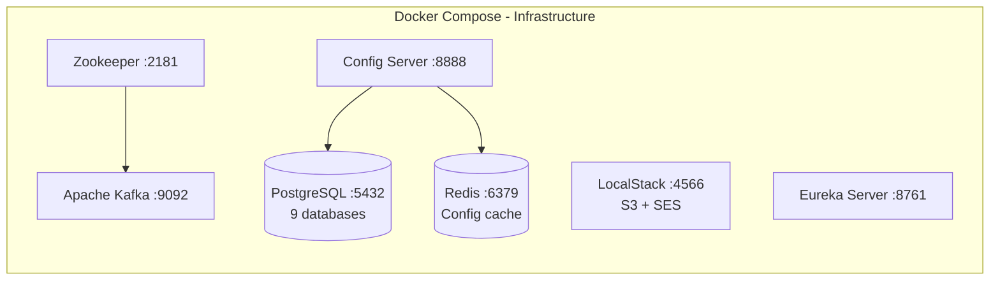

### 2.3 Service Communication Diagram

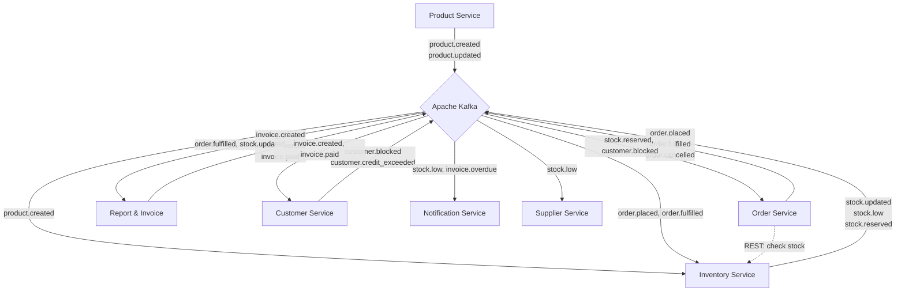

### 2.4 Request Flow: Create Sales Order

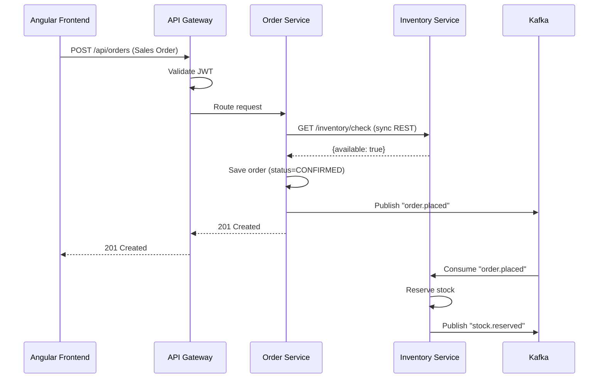

### 2.5 Authentication Flow

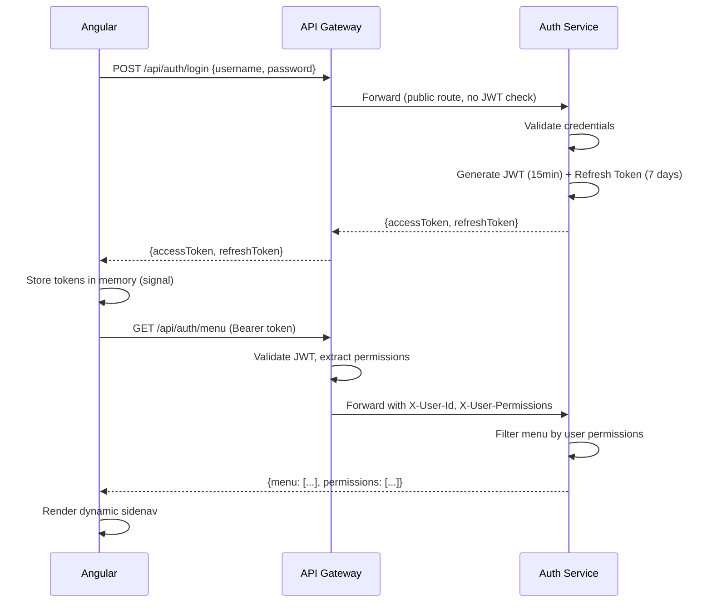

### 2.6 Invoice Auto-Generation Flow

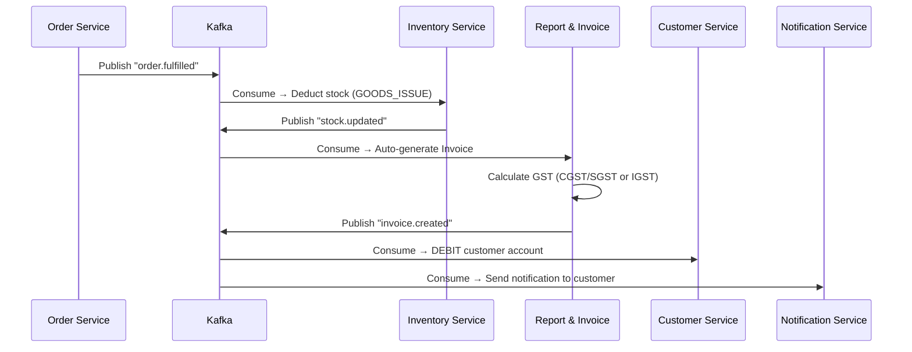

### 2.7 Order Status State Machines

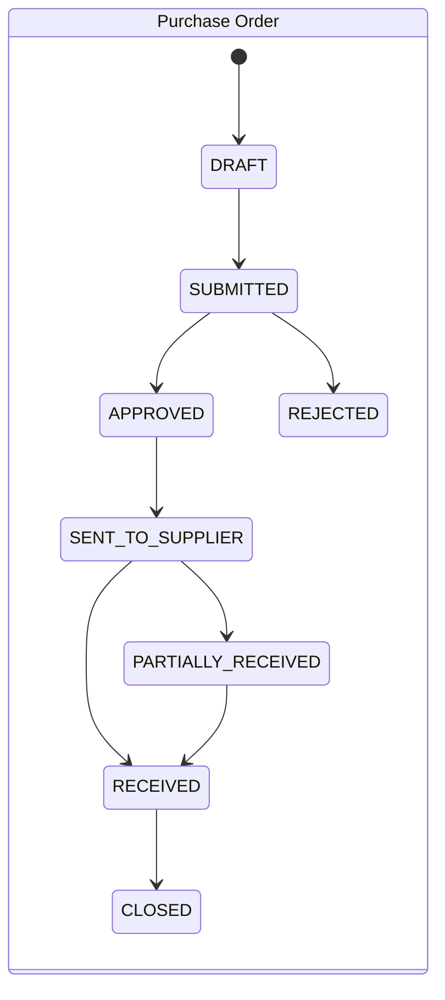

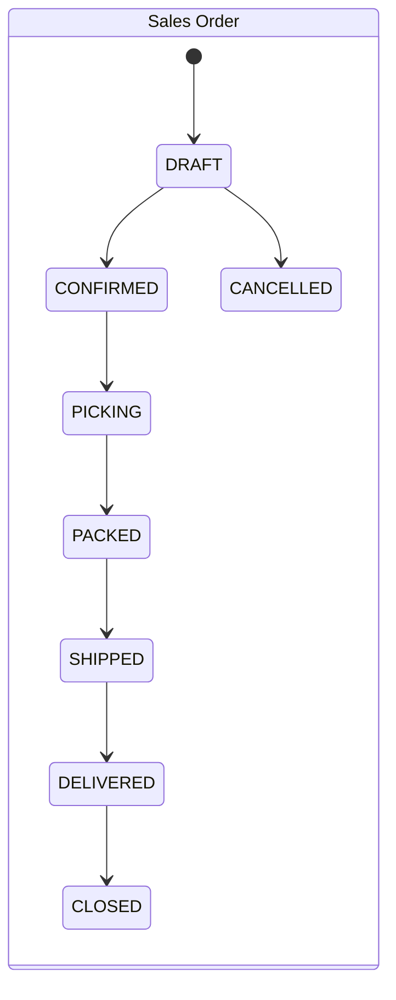

### 2.8 Invoice Status State Machine

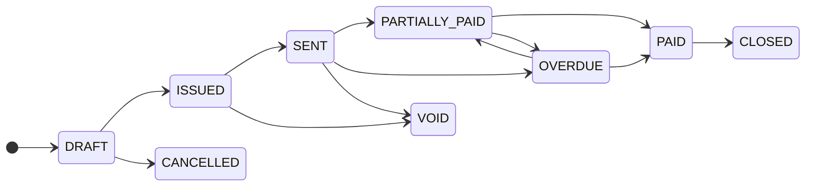

### 2.9 Customer Account Ledger Flow

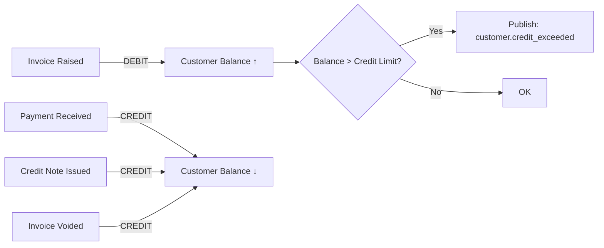

### 2.10 Docker Compose Container Map

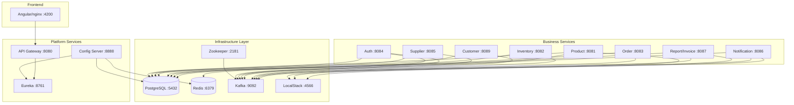

### 2.11 Discount Calculation Flow

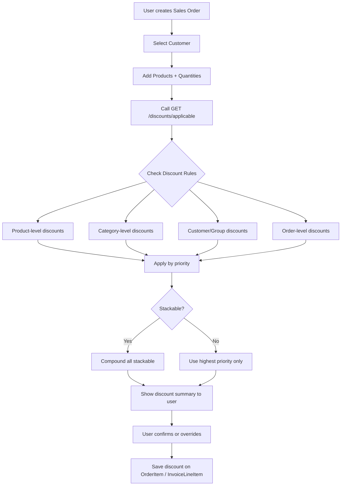

---

## 3. Service List Summary

| # | Service | Port | Database | Description |
|---|---------|------|----------|-------------|
| 1 | Eureka Server | 8761 | — | Service registry & discovery |
| 2 | Config Server | 8888 | config_db + Redis | Centralized config (DB-backed, Redis-cached) |
| 3 | API Gateway | 8080 | — | Routing, JWT validation, rate limiting |
| 4 | User & Auth Service | 8084 | auth_db | Users, Roles, Permissions, JWT, Dynamic Menu |
| 5 | Product Service | 8081 | product_db | Products, Categories, Attributes, SKUs |
| 6 | Supplier Service | 8085 | supplier_db | Suppliers, SupplierProduct mapping |
| 7 | Customer Service | 8089 | customer_db | Customers, Account ledger (debit/credit) |
| 8 | Inventory Service | 8082 | inventory_db | Stock levels, Movements, Reservations, Reorder |
| 9 | Order Service | 8083 | order_db | Purchase Orders, Sales Orders, Approvals |
| 10 | Reporting & Invoice Service | 8087 | report_invoice_db | Invoices, Tax, Payments, Discounts, Reports |
| 11 | Notification Service | 8086 | notification_db | Alerts, Templates, In-app + Email delivery |

### Infrastructure Containers

| # | Component | Port | Purpose |
|---|-----------|------|---------|
| 1 | PostgreSQL | 5432 | All databases (separate DB per service) |
| 2 | Redis | 6379 | Config cache, rate limiting, general cache |
| 3 | Apache Kafka | 9092 | Event bus (async communication) |
| 4 | Zookeeper | 2181 | Kafka coordination |
| 5 | LocalStack | 4566 | Local AWS (S3, SES) |
| 6 | Angular (nginx) | 4200 | Frontend |

**Total Containers: 17**

---

## 4. Infrastructure Components

### 4.1 PostgreSQL (Single Instance, Multiple Databases)

```
PostgreSQL (:5432)
├── config_db          → Config Server
├── auth_db            → User & Auth Service
├── product_db         → Product Service
├── supplier_db        → Supplier Service
├── customer_db        → Customer Service
├── inventory_db       → Inventory Service
├── order_db           → Order Service
├── report_invoice_db  → Reporting & Invoice Service
└── notification_db    → Notification Service
```

### 4.2 Redis

```
Redis (:6379)
├── DB 0: Config cache (TTL 5 min)
├── DB 1: Auth (refresh token blacklist, rate limit counters)
├── DB 2: General cache (stock levels, product lookups)
└── DB 3: API Gateway (rate limiting)
```

### 4.3 Apache Kafka Topics

```
product.created | product.updated | product.discontinued
stock.updated | stock.low | stock.reserved | stock.released
order.placed | order.fulfilled | order.cancelled | purchase.order.received
invoice.created | invoice.overdue | invoice.paid
customer.created | customer.credit_exceeded | customer.blocked
```

### 4.4 LocalStack

```
LocalStack (:4566)
├── S3: product-images, invoice-pdfs, import-files
└── SES: Email sending for notifications
```

---

## 5. Eureka Server

| Aspect | Detail |
|--------|--------|
| **Port** | 8761 |
| **Purpose** | Service registry. All services register here. Gateway discovers services via Eureka. |
| **Dashboard** | `http://localhost:8761` |

### Project Structure

```
eureka-server/
├── src/main/java/com/inventory/eureka/
│   └── EurekaServerApplication.java    (@EnableEurekaServer)
├── src/main/resources/application.yml
├── Dockerfile
└── pom.xml
```

### Dependencies

- `spring-cloud-starter-netflix-eureka-server`
- `spring-boot-starter-actuator`

---

## 6. Config Server

| Aspect | Detail |
|--------|--------|
| **Port** | 8888 |
| **Purpose** | Centralized configuration stored in PostgreSQL, cached in Redis |
| **Database** | config_db |

### Project Structure

```
config-server/
├── src/main/java/com/inventory/config/
│   ├── ConfigServerApplication.java
│   ├── controller/
│   │   ├── ConfigController.java           (serves config to services)
│   │   └── AdminConfigController.java      (admin CRUD)
│   ├── service/
│   │   ├── ConfigService.java
│   │   └── ConfigCacheService.java
│   ├── repository/
│   │   ├── ConfigPropertyRepository.java
│   │   └── ConfigChangeLogRepository.java
│   ├── entity/
│   │   ├── ConfigProperty.java
│   │   └── ConfigChangeLog.java
│   └── config/
│       └── RedisConfig.java
├── src/main/resources/application.yml
├── Dockerfile
└── pom.xml
```

### Entities

```
ConfigProperty: id, application, profile, label, prop_key, prop_value, is_encrypted, description, updated_by, updated_at
ConfigChangeLog: id, config_property_id, old_value, new_value, changed_by, changed_at, reason
```

### API Endpoints (8)

| Method | Endpoint | Description |
|--------|----------|-------------|
| GET | `/config/{application}/{profile}` | Get config (Spring Cloud Config protocol) |
| GET | `/admin/config` | List all properties |
| POST | `/admin/config` | Create property |
| PUT | `/admin/config/{id}` | Update property |
| DELETE | `/admin/config/{id}` | Delete property |
| POST | `/admin/config/refresh/{application}` | Invalidate cache + notify |
| POST | `/admin/config/refresh-all` | Refresh all services |
| GET | `/admin/config/changelog` | Audit trail |

### Cache Strategy

```
READ:  Service → Config Server → Redis (HIT? return) → PostgreSQL (store in Redis, TTL 5min) → return
WRITE: Admin update → PostgreSQL → log in ChangeLog → invalidate Redis key
```

---

## 7. API Gateway

| Aspect | Detail |
|--------|--------|
| **Port** | 8080 |
| **Purpose** | Single entry point. JWT validation, routing, rate limiting, CORS, circuit breaker. |

### Project Structure

```
api-gateway/
├── src/main/java/com/inventory/gateway/
│   ├── ApiGatewayApplication.java
│   ├── filter/
│   │   ├── JwtAuthenticationFilter.java
│   │   ├── CorrelationIdFilter.java
│   │   ├── RateLimitFilter.java
│   │   └── LoggingFilter.java
│   ├── config/
│   │   ├── GatewayRoutesConfig.java
│   │   ├── CorsConfig.java
│   │   └── CircuitBreakerConfig.java
│   └── util/
│       └── JwtUtil.java
├── src/main/resources/application.yml
├── Dockerfile
└── pom.xml
```

### Route Map

| Path Pattern | Target Service |
|-------------|----------------|
| `/api/auth/**`, `/api/users/**`, `/api/roles/**`, `/api/permissions/**`, `/api/admin/menu-items/**` | auth-service |
| `/api/products/**`, `/api/categories/**` | product-service |
| `/api/suppliers/**` | supplier-service |
| `/api/customers/**` | customer-service |
| `/api/inventory/**` | inventory-service |
| `/api/orders/**` | order-service |
| `/api/invoices/**`, `/api/reports/**`, `/api/tax-rates/**`, `/api/discounts/**`, `/api/customer-groups/**` | reporting-invoice-service |
| `/api/notifications/**` | notification-service |
| `/api/admin/config/**` | config-server |

### JWT Filter Logic

```
1. Extract Authorization header
2. Skip public paths: /api/auth/login, /api/auth/refresh, /actuator/health
3. Validate JWT signature + expiry
4. Extract claims → add as headers to downstream:
   X-User-Id, X-User-Roles, X-User-Permissions, X-Warehouse-Scope
5. Invalid → 401 Unauthorized
```

---

## 8. User & Auth Service

| Aspect | Detail |
|--------|--------|
| **Port** | 8084 |
| **Database** | auth_db |
| **Purpose** | Identity, authentication (JWT), authorization (RBAC), dynamic menu |

### Project Structure

```
auth-service/
├── src/main/java/com/inventory/auth/
│   ├── AuthServiceApplication.java
│   ├── controller/
│   │   ├── AuthController.java
│   │   ├── UserController.java
│   │   ├── RoleController.java
│   │   ├── PermissionController.java
│   │   └── MenuItemController.java
│   ├── service/
│   │   ├── AuthService.java
│   │   ├── UserService.java
│   │   ├── RoleService.java
│   │   ├── MenuService.java
│   │   ├── TokenService.java
│   │   └── AuditLogService.java
│   ├── repository/
│   │   ├── UserRepository.java
│   │   ├── RoleRepository.java
│   │   ├── PermissionRepository.java
│   │   ├── MenuItemRepository.java
│   │   ├── RefreshTokenRepository.java
│   │   └── AuditLogRepository.java
│   ├── entity/
│   │   ├── User.java
│   │   ├── Role.java
│   │   ├── Permission.java
│   │   ├── UserRole.java
│   │   ├── RolePermission.java
│   │   ├── MenuItem.java
│   │   ├── RefreshToken.java
│   │   └── AuditLog.java
│   ├── security/
│   │   ├── JwtTokenProvider.java
│   │   └── SecurityConfig.java
│   └── exception/
│       └── GlobalExceptionHandler.java
├── src/main/resources/
│   ├── application.yml
│   └── data.sql (seed: admin, roles, permissions, menu)
├── Dockerfile
└── pom.xml
```

### Entities

```
User:           id, username, email, password_hash, full_name, phone, status(ACTIVE/LOCKED/INACTIVE), failed_login_attempts, last_login, created_at
Role:           id, name, description, is_system_role, created_at
Permission:     id, code, resource, action, description
UserRole:       id, user_id, role_id, scope_type(GLOBAL/WAREHOUSE), scope_value
RolePermission: id, role_id, permission_id
MenuItem:       id, code, label, icon, route, parent_id, sort_order, required_permission, is_active
RefreshToken:   id, user_id, token_hash, expires_at, is_revoked
AuditLog:       id, user_id, action, resource, details, ip_address, timestamp
```

### API Endpoints (22)

| Method | Endpoint | Description |
|--------|----------|-------------|
| POST | `/auth/login` | Login → JWT tokens |
| POST | `/auth/refresh` | Refresh access token |
| POST | `/auth/logout` | Revoke refresh token |
| POST | `/auth/forgot-password` | Initiate reset |
| POST | `/auth/reset-password` | Complete reset |
| GET | `/auth/me` | Current user profile |
| GET | `/auth/menu` | Dynamic menu (filtered by permissions) |
| GET | `/auth/permissions` | User's permission list |
| GET | `/users` | List users |
| POST | `/users` | Create user |
| GET | `/users/{id}` | User detail |
| PUT | `/users/{id}` | Update user |
| PATCH | `/users/{id}/status` | Change status |
| PUT | `/users/{id}/roles` | Assign roles |
| GET | `/roles` | List roles |
| POST | `/roles` | Create role |
| PUT | `/roles/{id}` | Update role |
| PUT | `/roles/{id}/permissions` | Assign permissions |
| GET | `/permissions` | List all permissions |
| GET | `/admin/menu-items` | Menu config (admin) |
| POST | `/admin/menu-items` | Create menu item |
| PUT | `/admin/menu-items/{id}` | Update menu item |

### RBAC Matrix

| Permission | Admin | Warehouse Mgr | Procurement | Accountant | Viewer |
|-----------|-------|---------------|-------------|------------|--------|
| DASHBOARD.VIEW | ✅ | ✅ | ✅ | ✅ | ✅ |
| PRODUCTS.VIEW | ✅ | ✅ | ✅ | ❌ | ✅ |
| PRODUCTS.CREATE | ✅ | ❌ | ✅ | ❌ | ❌ |
| INVENTORY.VIEW | ✅ | ✅ | ❌ | ❌ | ✅ |
| INVENTORY.ADJUST | ✅ | ✅ | ❌ | ❌ | ❌ |
| ORDERS.VIEW | ✅ | ✅ | ✅ | ✅ | ✅ |
| ORDERS.CREATE | ✅ | ❌ | ✅ | ❌ | ❌ |
| ORDERS.APPROVE | ✅ | ❌ | ✅ | ❌ | ❌ |
| SUPPLIERS.VIEW | ✅ | ❌ | ✅ | ❌ | ✅ |
| CUSTOMERS.VIEW | ✅ | ❌ | ✅ | ✅ | ✅ |
| INVOICES.VIEW | ✅ | ❌ | ✅ | ✅ | ✅ |
| INVOICES.CREATE | ✅ | ❌ | ❌ | ✅ | ❌ |
| REPORTS.VIEW | ✅ | ✅ | ✅ | ✅ | ✅ |
| REPORTS.FINANCIAL | ✅ | ❌ | ❌ | ✅ | ❌ |
| USERS.MANAGE | ✅ | ❌ | ❌ | ❌ | ❌ |
| SETTINGS.SYSTEM | ✅ | ❌ | ❌ | ❌ | ❌ |
| DISCOUNTS.OVERRIDE | ✅ | ❌ | ✅ | ❌ | ❌ |

### Business Rules

- Password: min 8 chars, 1 uppercase, 1 number, 1 special
- Account locks after 5 failed attempts (auto-unlock 30 min or admin)
- JWT access token: 15 min. Refresh token: 7 days (hashed in DB, revocable)
- System roles (ADMIN, VIEWER) cannot be deleted
- Menu: backend returns only items user has permission for
- All auth events logged in AuditLog

---

## 9. Product Service

| Aspect | Detail |
|--------|--------|
| **Port** | 8081 |
| **Database** | product_db |
| **Purpose** | Product catalog — products, categories, attributes, images, SKUs |

### Project Structure

```
product-service/
├── src/main/java/com/inventory/product/
│   ├── ProductServiceApplication.java
│   ├── controller/
│   │   ├── ProductController.java
│   │   ├── CategoryController.java
│   │   └── BulkImportController.java
│   ├── service/
│   │   ├── ProductService.java
│   │   ├── CategoryService.java
│   │   ├── SkuGeneratorService.java
│   │   └── S3StorageService.java
│   ├── repository/
│   │   ├── ProductRepository.java
│   │   ├── CategoryRepository.java
│   │   ├── ProductAttributeRepository.java
│   │   └── ProductImageRepository.java
│   ├── entity/
│   │   ├── Product.java
│   │   ├── Category.java
│   │   ├── ProductAttribute.java
│   │   └── ProductImage.java
│   ├── event/
│   │   └── ProductEventPublisher.java
│   └── exception/
│       └── GlobalExceptionHandler.java
├── Dockerfile
└── pom.xml
```

### Entities

```
Product:          id, sku(unique), name, description, category_id, unit_of_measure, hsn_code, base_price, status(ACTIVE/DISCONTINUED), created_by, created_at, updated_at
Category:         id, name, parent_id, sort_order, is_active, created_at
ProductAttribute: id, product_id, attribute_key, attribute_value, sort_order
ProductImage:     id, product_id, image_url, is_primary, sort_order, uploaded_at
```

### API Endpoints (12)

| Method | Endpoint | Description |
|--------|----------|-------------|
| POST | `/products` | Create product |
| GET | `/products` | List/search (paginated) |
| GET | `/products/{id}` | Product detail |
| PUT | `/products/{id}` | Update product |
| PATCH | `/products/{id}/status` | Activate/Discontinue |
| POST | `/products/{id}/images` | Upload image |
| DELETE | `/products/{id}/images/{imageId}` | Remove image |
| POST | `/products/bulk-import` | CSV bulk upload |
| GET | `/products/export` | Export CSV |
| GET | `/categories` | Category tree |
| POST | `/categories` | Create category |
| PUT | `/categories/{id}` | Update category |

### Events Published

| Event | Consumers |
|-------|-----------|
| `product.created` | Inventory (create stock record qty=0) |
| `product.updated` | Reporting (update denormalized data) |
| `product.discontinued` | Inventory (flag for clearance) |

### Business Rules

- SKU unique, auto-generated if not provided (format: CAT-XXXXX)
- SKU immutable once created
- Cannot delete product with stock (soft-delete → DISCONTINUED)
- HSN code mandatory (for GST)
- Category max 3-level nesting
- Max 5 images per product
- Bulk import: all-or-nothing validation

---

## 10. Supplier Service

| Aspect | Detail |
|--------|--------|
| **Port** | 8085 |
| **Database** | supplier_db |
| **Purpose** | Supplier master data + product-supplier mapping (cost, lead time) |

### Project Structure

```
supplier-service/
├── src/main/java/com/inventory/supplier/
│   ├── SupplierServiceApplication.java
│   ├── controller/
│   │   ├── SupplierController.java
│   │   └── SupplierProductController.java
│   ├── service/
│   │   ├── SupplierService.java
│   │   └── SupplierProductService.java
│   ├── repository/
│   │   ├── SupplierRepository.java
│   │   └── SupplierProductRepository.java
│   ├── entity/
│   │   ├── Supplier.java
│   │   └── SupplierProduct.java
│   ├── event/
│   │   └── StockLowEventConsumer.java
│   └── exception/
│       └── GlobalExceptionHandler.java
├── Dockerfile
└── pom.xml
```

### Entities

```
Supplier:        id, code(unique, auto: SUP-00001), name, contact_person, email, phone, address, city, state, pincode, gstin(unique), payment_terms, status(ACTIVE/INACTIVE), created_by, created_at
SupplierProduct: id, supplier_id, product_id, supplier_sku, unit_cost, lead_time_days, min_order_quantity, is_preferred, created_at
```

### API Endpoints (10)

| Method | Endpoint | Description |
|--------|----------|-------------|
| POST | `/suppliers` | Create supplier |
| GET | `/suppliers` | List/search |
| GET | `/suppliers/{id}` | Supplier detail |
| PUT | `/suppliers/{id}` | Update |
| PATCH | `/suppliers/{id}/status` | Activate/Deactivate |
| GET | `/suppliers/{id}/products` | Supplier's products |
| POST | `/suppliers/{id}/products` | Link product |
| PUT | `/suppliers/{id}/products/{spId}` | Update link |
| DELETE | `/suppliers/{id}/products/{spId}` | Unlink |
| GET | `/suppliers/for-product/{productId}` | Suppliers for product (ranked) |

### Events Consumed

| Event | Action |
|-------|--------|
| `stock.low` | Identify preferred supplier for PO suggestion |

### Business Rules

- GSTIN validated (15-char format)
- Each product: multiple suppliers, one `is_preferred = true`
- Setting new preferred auto-unsets previous
- Inactive suppliers blocked from new POs
- `unit_cost` = purchase price (distinct from product `base_price` = selling price)

---

## 11. Customer Service

| Aspect | Detail |
|--------|--------|
| **Port** | 8089 |
| **Database** | customer_db |
| **Purpose** | Customer master data + financial account ledger (debit/credit tracking) |

### Project Structure

```
customer-service/
├── src/main/java/com/inventory/customer/
│   ├── CustomerServiceApplication.java
│   ├── controller/
│   │   ├── CustomerController.java
│   │   └── CustomerAccountController.java
│   ├── service/
│   │   ├── CustomerService.java
│   │   ├── CustomerAccountService.java
│   │   └── CustomerStatementService.java
│   ├── repository/
│   │   ├── CustomerRepository.java
│   │   └── AccountTransactionRepository.java
│   ├── entity/
│   │   ├── Customer.java
│   │   └── AccountTransaction.java
│   ├── event/
│   │   ├── InvoiceEventConsumer.java
│   │   └── CustomerEventPublisher.java
│   └── exception/
│       └── GlobalExceptionHandler.java
├── Dockerfile
└── pom.xml
```

### Entities

```
Customer:
  id, code(unique, auto: CUST-00001), name, contact_person, email, phone,
  address, city, state, pincode, gstin, pan, credit_limit, payment_terms,
  opening_balance, current_balance, status(ACTIVE/INACTIVE/BLOCKED),
  notes, created_by, created_at, updated_at

AccountTransaction:
  id, customer_id, transaction_type(DEBIT/CREDIT), amount,
  balance_after, reference_type(INVOICE/PAYMENT/CREDIT_NOTE/OPENING_BALANCE/ADJUSTMENT),
  reference_id, reference_number, description, transaction_date, created_by, created_at
```

### Account Logic

```
DEBIT (customer owes more):  Invoice raised → DEBIT → current_balance increases
CREDIT (customer owes less): Payment received → CREDIT → current_balance decreases

current_balance = opening_balance + Σ(debits) - Σ(credits)
Positive = customer owes us | Negative = we owe customer | Zero = settled
```

### API Endpoints (12)

| Method | Endpoint | Description |
|--------|----------|-------------|
| POST | `/customers` | Create customer |
| GET | `/customers` | List/search |
| GET | `/customers/{id}` | Customer detail |
| PUT | `/customers/{id}` | Update |
| PATCH | `/customers/{id}/status` | Activate/Deactivate/Block |
| GET | `/customers/{id}/account` | Account summary (balance, credit limit) |
| GET | `/customers/{id}/transactions` | Transaction history |
| POST | `/customers/{id}/transactions` | Manual adjustment |
| GET | `/customers/{id}/statement` | Statement for date range |
| GET | `/customers/outstanding` | All with positive balance |
| GET | `/customers/credit-exceeded` | Over credit limit |
| GET | `/customers/search` | Quick search |

### Events Consumed

| Event | Source | Action |
|-------|--------|--------|
| `invoice.created` | Reporting & Invoice | DEBIT customer (invoice amount) |
| `invoice.paid` | Reporting & Invoice | CREDIT customer (payment amount) |
| `invoice.voided` | Reporting & Invoice | CREDIT customer (reverse debit) |

### Events Published

| Event | Consumers |
|-------|-----------|
| `customer.created` | Reporting |
| `customer.credit_exceeded` | Notification (alert sales team) |
| `customer.blocked` | Order Service (reject new SO) |

### Business Rules

- GSTIN validation (15-char, same as supplier)
- Credit limit check: after debit, if balance > limit → publish `customer.credit_exceeded`
- BLOCKED customers cannot have new sales orders
- Opening balance creates initial transaction
- Manual adjustments require description
- `current_balance` denormalized for fast reads (recalculable from transactions)

---

## 12. Inventory Service

| Aspect | Detail |
|--------|--------|
| **Port** | 8082 |
| **Database** | inventory_db |
| **Purpose** | Real-time stock tracking, reservations, movements, reorder alerts. Single location. |

### Project Structure

```
inventory-service/
├── src/main/java/com/inventory/stock/
│   ├── InventoryServiceApplication.java
│   ├── controller/
│   │   ├── StockController.java
│   │   ├── StockMovementController.java
│   │   └── ReorderRuleController.java
│   ├── service/
│   │   ├── StockService.java
│   │   ├── StockMovementService.java
│   │   ├── ReservationService.java
│   │   ├── ReorderService.java
│   │   └── StockValidationService.java
│   ├── repository/
│   │   ├── StockRepository.java
│   │   ├── StockMovementRepository.java
│   │   └── ReorderRuleRepository.java
│   ├── entity/
│   │   ├── Stock.java
│   │   ├── StockMovement.java
│   │   └── ReorderRule.java
│   ├── event/
│   │   ├── StockEventPublisher.java
│   │   ├── ProductEventConsumer.java
│   │   └── OrderEventConsumer.java
│   ├── scheduler/
│   │   ├── LowStockCheckScheduler.java
│   │   └── ReservationExpiryScheduler.java
│   └── exception/
│       └── GlobalExceptionHandler.java
├── Dockerfile
└── pom.xml
```

### Entities

```
Stock:
  id, product_id, location_code(optional: bin/rack), quantity_on_hand,
  quantity_reserved, version(@Version for optimistic locking),
  last_movement_at, created_at, updated_at
  [computed: quantity_available = on_hand - reserved]

StockMovement:
  id, product_id, movement_type(GOODS_RECEIPT/GOODS_ISSUE/ADJUSTMENT/RESERVATION/RELEASE),
  quantity, quantity_before, quantity_after,
  reference_type(PURCHASE_ORDER/SALES_ORDER/MANUAL/SYSTEM),
  reference_id, reason_code(DAMAGE/THEFT/AUDIT/EXPIRY/RETURN/OTHER),
  notes, performed_by, timestamp

ReorderRule:
  id, product_id, reorder_point, reorder_quantity,
  is_auto_reorder, is_active, last_triggered_at, created_at
```

### API Endpoints (15)

| Method | Endpoint | Description |
|--------|----------|-------------|
| GET | `/inventory` | All stock (paginated) |
| GET | `/inventory/{productId}` | Stock for product |
| GET | `/inventory/check` | Availability check |
| POST | `/inventory/receive` | Goods receipt |
| POST | `/inventory/issue` | Goods issue |
| POST | `/inventory/adjust` | Manual adjustment |
| POST | `/inventory/reserve` | Reserve stock |
| POST | `/inventory/release` | Release reservation |
| GET | `/inventory/low-stock` | Below reorder point |
| GET | `/inventory/movements` | Movement history |
| GET | `/inventory/movements/{productId}` | Product movements |
| GET | `/inventory/reorder-rules` | List rules |
| POST | `/inventory/reorder-rules` | Create rule |
| PUT | `/inventory/reorder-rules/{id}` | Update rule |
| DELETE | `/inventory/reorder-rules/{id}` | Delete rule |

### Events Published

| Event | Trigger |
|-------|---------|
| `stock.updated` | Any quantity change |
| `stock.low` | qty_available <= reorder_point |
| `stock.reserved` | Successful reservation |
| `stock.released` | Reservation released |

### Events Consumed

| Event | Action |
|-------|--------|
| `product.created` | Create stock record (qty=0) |
| `order.placed` | Reserve stock |
| `order.cancelled` | Release reservation |
| `order.fulfilled` | Convert reservation to deduction |
| `purchase.order.received` | Goods receipt (increase stock) |

### Business Rules

- `quantity_available = on_hand - reserved` — NEVER negative
- Every change = StockMovement record (immutable audit)
- Optimistic locking via `@Version` (retry on conflict)
- Reservations expire after 30 min (configurable, scheduler every 5 min)
- Adjustments MUST have reason_code
- Low-stock check: every 4 hours OR on every stock.updated
- Cannot issue more than available (InsufficientStockException)

---

## 13. Order Service

| Aspect | Detail |
|--------|--------|
| **Port** | 8083 |
| **Database** | order_db |
| **Purpose** | Purchase Orders (PO) and Sales Orders (SO) lifecycle, approvals |

### Project Structure

```
order-service/
├── src/main/java/com/inventory/order/
│   ├── OrderServiceApplication.java
│   ├── controller/
│   │   ├── OrderController.java
│   │   ├── OrderItemController.java
│   │   └── ApprovalController.java
│   ├── service/
│   │   ├── OrderService.java
│   │   ├── OrderItemService.java
│   │   ├── OrderStatusService.java
│   │   ├── ApprovalService.java
│   │   └── InventoryClient.java
│   ├── repository/
│   │   ├── OrderRepository.java
│   │   ├── OrderItemRepository.java
│   │   └── OrderStatusHistoryRepository.java
│   ├── entity/
│   │   ├── Order.java
│   │   ├── OrderItem.java
│   │   └── OrderStatusHistory.java
│   ├── statemachine/
│   │   ├── PurchaseOrderStateMachine.java
│   │   └── SalesOrderStateMachine.java
│   ├── event/
│   │   ├── OrderEventPublisher.java
│   │   └── StockEventConsumer.java
│   └── exception/
│       └── GlobalExceptionHandler.java
├── Dockerfile
└── pom.xml
```

### Entities

```
Order:
  id, order_number(unique: PO-2526-00001/SO-2526-00001), type(PURCHASE/SALES),
  status, party_id, party_name, party_gstin, subtotal, tax_amount,
  discount_amount, total_amount, notes, requires_approval, approved_by,
  approved_at, created_by, created_at, updated_at

OrderItem:
  id, order_id, product_id, product_name, product_sku, hsn_code,
  quantity_ordered, quantity_received(for PO), unit_price, discount_percent,
  tax_rate, line_total, created_at

OrderStatusHistory:
  id, order_id, from_status, to_status, changed_by, reason, timestamp
```

### Status State Machines

```
PURCHASE ORDER:
  DRAFT → SUBMITTED → APPROVED → SENT_TO_SUPPLIER → PARTIALLY_RECEIVED → RECEIVED → CLOSED
                   ↘ REJECTED

SALES ORDER:
  DRAFT → CONFIRMED → PICKING → PACKED → SHIPPED → DELIVERED → CLOSED
       ↘ CANCELLED
```

### API Endpoints (12)

| Method | Endpoint | Description |
|--------|----------|-------------|
| POST | `/orders` | Create order |
| GET | `/orders` | List with filters |
| GET | `/orders/{id}` | Order detail + items + history |
| PUT | `/orders/{id}` | Update draft |
| PATCH | `/orders/{id}/status` | Transition status |
| POST | `/orders/{id}/items` | Add item |
| PUT | `/orders/{id}/items/{itemId}` | Update item |
| DELETE | `/orders/{id}/items/{itemId}` | Remove item |
| POST | `/orders/{id}/receive` | Goods receipt (PO) |
| GET | `/orders/pending-approval` | Approval queue |
| PATCH | `/orders/{id}/approve` | Approve |
| PATCH | `/orders/{id}/reject` | Reject |

### Events Published

| Event | Trigger |
|-------|---------|
| `order.placed` | SO confirmed |
| `order.fulfilled` | SO delivered/closed |
| `order.cancelled` | SO cancelled |
| `purchase.order.received` | PO goods received |

### Events Consumed

| Event | Action |
|-------|--------|
| `stock.reserved` | Confirm order can proceed |
| `stock.low` | Auto-create PO draft (if auto-reorder) |
| `customer.blocked` | Reject new SO for blocked customer |

### Business Rules

- Order number: PO-YYMM-NNNNN / SO-YYMM-NNNNN
- Status transitions strictly validated
- Only DRAFT orders editable
- PO above threshold (configurable) requires approval
- SO confirmation requires stock check (sync REST to Inventory)
- Partial receipt: track quantity_received per item
- Cancellation/rejection requires reason

---

## 14. Reporting, Analytics & Invoice Service

| Aspect | Detail |
|--------|--------|
| **Port** | 8087 |
| **Database** | report_invoice_db |
| **Purpose** | Invoicing (GST), payments, credit notes, discounts, all reports/dashboards |

### Project Structure

```
reporting-invoice-service/
├── src/main/java/com/inventory/reporting/
│   ├── ReportingInvoiceServiceApplication.java
│   ├── controller/
│   │   ├── InvoiceController.java
│   │   ├── PaymentController.java
│   │   ├── CreditNoteController.java
│   │   ├── TaxRateController.java
│   │   ├── DiscountController.java
│   │   ├── CustomerGroupController.java
│   │   └── ReportController.java
│   ├── service/
│   │   ├── InvoiceService.java
│   │   ├── TaxCalculationService.java
│   │   ├── PaymentService.java
│   │   ├── CreditNoteService.java
│   │   ├── InvoicePdfService.java
│   │   ├── DiscountService.java
│   │   ├── DiscountCalculationService.java
│   │   ├── CustomerGroupService.java
│   │   ├── DashboardService.java
│   │   └── ReportService.java
│   ├── repository/ (Invoice, LineItem, TaxRate, Payment, CreditNote, Discount, CustomerGroup, Snapshots)
│   ├── entity/
│   │   ├── Invoice.java
│   │   ├── InvoiceLineItem.java
│   │   ├── TaxRate.java
│   │   ├── PaymentRecord.java
│   │   ├── CreditNote.java
│   │   ├── DiscountRule.java
│   │   ├── CustomerGroup.java
│   │   ├── CustomerGroupMember.java
│   │   └── DailyStockSnapshot.java
│   ├── event/
│   │   ├── OrderEventConsumer.java
│   │   ├── StockEventConsumer.java
│   │   └── InvoiceEventPublisher.java
│   ├── scheduler/
│   │   ├── OverdueInvoiceScheduler.java
│   │   └── DailySnapshotScheduler.java
│   └── exception/
│       └── GlobalExceptionHandler.java
├── Dockerfile
└── pom.xml
```

### Entities

```
Invoice:
  id, invoice_number(INV-2526-00001), type(SALES_INVOICE/PURCHASE_INVOICE/CREDIT_NOTE),
  status(DRAFT/ISSUED/SENT/PARTIALLY_PAID/PAID/OVERDUE/CANCELLED/VOID),
  order_id, order_number, party_id, party_name, party_gstin, party_state,
  company_state, invoice_date, due_date, subtotal, cgst_amount, sgst_amount,
  igst_amount, total_tax_amount, discount_amount, total_amount, amount_paid,
  balance_due, currency(INR), notes, pdf_url, created_by, created_at

InvoiceLineItem:
  id, invoice_id, product_id, product_name, product_sku, hsn_code,
  quantity, unit_price, discount_percent, taxable_amount,
  cgst_rate, cgst_amount, sgst_rate, sgst_amount, igst_rate, igst_amount,
  line_total

TaxRate:         id, name, rate_percent, tax_type(GST/CESS), is_active, effective_from
PaymentRecord:   id, invoice_id, amount, payment_date, payment_method, reference_number, notes, recorded_by
CreditNote:      id, credit_note_number, original_invoice_id, reason, amount, status(ISSUED/APPLIED), applied_to_invoice_id

DiscountRule:
  id, name, type(PERCENTAGE/FLAT_AMOUNT), value, scope(PRODUCT/CATEGORY/ORDER/CUSTOMER/CUSTOMER_GROUP),
  scope_id, min_quantity, min_order_value, start_date, end_date,
  is_stackable, priority, is_active, created_by

CustomerGroup:       id, name, description, default_discount_rule_id, is_active
CustomerGroupMember: id, customer_group_id, customer_id, customer_name, added_at
DailyStockSnapshot:  id, snapshot_date, product_id, quantity_on_hand, unit_cost, total_value
```

### Tax Calculation (GST)

```
Per line item:
  taxable_amount = quantity × unit_price × (1 - discount_percent/100)

  if (company_state == party_state):   // Intra-state
    cgst = taxable_amount × (rate/2) / 100
    sgst = taxable_amount × (rate/2) / 100
  else:                                 // Inter-state
    igst = taxable_amount × rate / 100

Invoice totals:
  subtotal = Σ taxable_amounts
  total_tax = Σ (cgst + sgst + igst)
  total_amount = subtotal + total_tax - discount_amount
  balance_due = total_amount - amount_paid
```

### API Endpoints (28)

**Invoices:**

| Method | Endpoint | Description |
|--------|----------|-------------|
| POST | `/invoices` | Create manually |
| POST | `/invoices/from-order/{orderId}` | Auto-generate |
| GET | `/invoices` | List |
| GET | `/invoices/{id}` | Detail |
| PUT | `/invoices/{id}` | Update draft |
| PATCH | `/invoices/{id}/status` | Transition |
| POST | `/invoices/{id}/payments` | Record payment |
| GET | `/invoices/{id}/payments` | Payment history |
| POST | `/invoices/{id}/credit-note` | Issue credit note |
| GET | `/invoices/{id}/pdf` | Generate PDF |
| GET | `/invoices/overdue` | Overdue list |
| POST | `/invoices/bulk-generate` | Bulk generate |

**Tax:** GET `/tax-rates`, POST `/tax-rates`, PUT `/tax-rates/{id}`

**Discounts:**

| Method | Endpoint | Description |
|--------|----------|-------------|
| GET | `/discounts/applicable` | Calculate for customer+products |
| GET | `/discounts` | List rules |
| POST | `/discounts` | Create |
| PUT | `/discounts/{id}` | Update |
| DELETE | `/discounts/{id}` | Delete |
| GET | `/customer-groups` | List groups |
| POST | `/customer-groups` | Create |
| POST | `/customer-groups/{id}/members` | Add member |
| DELETE | `/customer-groups/{id}/members/{custId}` | Remove |

**Reports:** GET `/reports/dashboard`, `/reports/stock-valuation`, `/reports/aging`, `/reports/tax-summary`

### Events

**Published:** `invoice.created`, `invoice.overdue`, `invoice.paid`  
**Consumed:** `order.fulfilled` (auto-generate invoice), `purchase.order.received`, `stock.updated`, `order.placed`, `order.cancelled`

### Business Rules

- Invoice number: INV-YYMM-NNNNN (financial year)
- Once ISSUED → immutable (void with credit note only)
- Overdue: daily scheduler checks due_date < today
- Partial payments supported
- Auto-generate on `order.fulfilled` (configurable: DRAFT or auto-ISSUE)
- Discount priority: Product → Category → Customer → Order
- Stackable discounts compound; non-stackable: highest-priority only

---

## 15. Notification Service

| Aspect | Detail |
|--------|--------|
| **Port** | 8086 |
| **Database** | notification_db |
| **Purpose** | Multi-channel alerts (in-app + email), templates, preferences, WebSocket |

### Project Structure

```
notification-service/
├── src/main/java/com/inventory/notification/
│   ├── NotificationServiceApplication.java
│   ├── controller/
│   │   ├── NotificationController.java
│   │   ├── NotificationPreferenceController.java
│   │   └── AdminTemplateController.java
│   ├── service/
│   │   ├── NotificationService.java
│   │   ├── NotificationDispatcher.java
│   │   ├── TemplateService.java
│   │   ├── EmailDeliveryService.java
│   │   └── InAppDeliveryService.java
│   ├── repository/
│   │   ├── NotificationLogRepository.java
│   │   ├── NotificationTemplateRepository.java
│   │   └── NotificationPreferenceRepository.java
│   ├── entity/
│   │   ├── NotificationLog.java
│   │   ├── NotificationTemplate.java
│   │   └── NotificationPreference.java
│   ├── event/ (StockEventConsumer, OrderEventConsumer, InvoiceEventConsumer)
│   ├── websocket/
│   │   └── NotificationWebSocketHandler.java
│   └── exception/
│       └── GlobalExceptionHandler.java
├── Dockerfile
└── pom.xml
```

### Entities

```
NotificationTemplate: id, event_type, channel(IN_APP/EMAIL), subject_template, body_template, is_active
NotificationPreference: id, user_id, event_type, channels(JSON), is_muted
NotificationLog: id, user_id, event_type, channel, title, body, data(JSON), status(PENDING/SENT/FAILED/READ), retry_count, error_message, sent_at, read_at, created_at
```

### API Endpoints (10)

| Method | Endpoint | Description |
|--------|----------|-------------|
| GET | `/notifications` | User inbox |
| GET | `/notifications/unread-count` | Badge count |
| PATCH | `/notifications/{id}/read` | Mark read |
| PATCH | `/notifications/read-all` | Mark all read |
| DELETE | `/notifications/{id}` | Delete |
| GET | `/notifications/preferences` | User preferences |
| PUT | `/notifications/preferences` | Update preferences |
| GET | `/admin/notifications/templates` | List templates |
| POST | `/admin/notifications/templates` | Create template |
| PUT | `/admin/notifications/templates/{id}` | Update template |

### Events Consumed

| Event | Notification |
|-------|-------------|
| `stock.low` | "⚠️ {productName} below reorder point" |
| `order.placed` | "📦 Order {orderNumber} created" |
| `order.fulfilled` | "✅ Order {orderNumber} fulfilled" |
| `invoice.overdue` | "🔴 Invoice {invoiceNumber} overdue — ₹{balance}" |
| `invoice.paid` | "💰 Payment received for {invoiceNumber}" |
| `customer.credit_exceeded` | "⚠️ {customerName} exceeded credit limit" |

### Business Rules

- Templates use `{{placeholder}}` syntax
- Users can mute events (critical alerts bypass mute)
- Failed deliveries retry 3x (exponential backoff)
- Rate limit: 20/user/hour
- In-app: REST + WebSocket real-time push
- Email: LocalStack SES
- Auto-delete after 90 days

---

## 16. Event-Driven Communication

### 16.1 Complete Event Map

| Event | Producer | Consumers |
|-------|----------|-----------|
| `product.created` | Product | Inventory |
| `product.updated` | Product | Reporting |
| `product.discontinued` | Product | Inventory |
| `stock.updated` | Inventory | Reporting |
| `stock.low` | Inventory | Notification, Supplier |
| `stock.reserved` | Inventory | Order |
| `stock.released` | Inventory | Order |
| `order.placed` | Order | Inventory, Reporting |
| `order.fulfilled` | Order | Inventory, Reporting (auto-invoice) |
| `order.cancelled` | Order | Inventory, Reporting |
| `purchase.order.received` | Order | Inventory, Reporting |
| `invoice.created` | Reporting | Notification, Customer (debit) |
| `invoice.overdue` | Reporting | Notification |
| `invoice.paid` | Reporting | Notification, Customer (credit) |
| `invoice.voided` | Reporting | Customer (credit reversal) |
| `customer.created` | Customer | Reporting |
| `customer.credit_exceeded` | Customer | Notification |
| `customer.blocked` | Customer | Order |

### 16.2 Event Envelope Standard

```json
{
  "eventId": "uuid",
  "eventType": "stock.low",
  "timestamp": "2026-05-25T10:30:00Z",
  "source": "inventory-service",
  "correlationId": "uuid",
  "payload": { }
}
```

### 16.3 Consumer Groups

| Consumer Group | Service | Topics |
|---------------|---------|--------|
| `inventory-group` | Inventory | product.*, order.placed, order.fulfilled, order.cancelled, purchase.order.received |
| `order-group` | Order | stock.reserved, stock.released, stock.low, customer.blocked |
| `reporting-group` | Reporting & Invoice | order.*, stock.updated, product.updated |
| `notification-group` | Notification | stock.low, order.*, invoice.*, customer.credit_exceeded |
| `customer-group` | Customer | invoice.created, invoice.paid, invoice.voided |
| `supplier-group` | Supplier | stock.low |

### 16.4 Sync vs Async

| Communication | Type | Reason |
|--------------|------|--------|
| Order → Inventory (check stock) | Sync REST | Need immediate yes/no |
| Order → Inventory (reserve) | Async Kafka | Eventual consistency OK |
| Any → Notification | Async Kafka | Fire-and-forget |
| Reporting → Customer (debit/credit) | Async Kafka | Eventual consistency |

### 16.5 Dead Letter Queue

Failed events after 3 retries → `{topic}.DLT` (e.g., `order.placed.DLT`)

---

## 17. Common API Response Standard

### 17.1 Success Response

```json
{
  "success": true,
  "status": 200,
  "message": "Products retrieved successfully",
  "data": { ... },
  "timestamp": "2026-05-25T10:30:00.123Z",
  "path": "/api/products",
  "correlationId": "abc-123-def-456"
}
```

### 17.2 Error Response

```json
{
  "success": false,
  "status": 404,
  "message": "Product not found",
  "error": {
    "code": "PRD_001",
    "details": "No product exists with ID: 550e8400-e29b-41d4-a716-446655440000",
    "field": null,
    "suggestions": ["Check the product ID and try again"]
  },
  "timestamp": "2026-05-25T10:30:00.123Z",
  "path": "/api/products/550e8400-e29b-41d4-a716-446655440000",
  "correlationId": "abc-123-def-456"
}
```

### 17.3 Validation Error Response

```json
{
  "success": false,
  "status": 400,
  "message": "Validation failed",
  "error": {
    "code": "COM_001",
    "details": "Request body has 3 validation errors",
    "fieldErrors": [
      { "field": "name", "message": "Product name is required", "rejectedValue": null },
      { "field": "basePrice", "message": "Price must be greater than 0", "rejectedValue": -10.00 },
      { "field": "hsnCode", "message": "HSN code must be 4-8 digits", "rejectedValue": "AB" }
    ]
  },
  "timestamp": "2026-05-25T10:30:00.123Z",
  "path": "/api/products",
  "correlationId": "abc-123-def-456"
}
```

### 17.4 Java Classes

```java
public class ApiResponse<T> {
    private boolean success;
    private int status;
    private String message;
    private T data;
    private ErrorDetails error;
    private String timestamp;
    private String path;
    private String correlationId;
}

public class ErrorDetails {
    private String code;
    private String details;
    private String field;
    private List<FieldError> fieldErrors;
    private List<String> suggestions;
}

public class FieldError {
    private String field;
    private String message;
    private Object rejectedValue;
}
```

---

## 18. Pagination Standard

### 18.1 Request Parameters

| Parameter | Type | Default | Description |
|-----------|------|---------|-------------|
| `page` | int | 0 | Page number (0-indexed) |
| `size` | int | 20 | Items per page (max: 100) |
| `sort` | string | `createdAt,desc` | Sort field + direction |
| `search` | string | null | Global search keyword |

```
GET /api/products?page=0&size=20&sort=name,asc&search=earphone
GET /api/orders?page=1&size=50&sort=createdAt,desc&status=CONFIRMED
```

### 18.2 Paginated Response

```json
{
  "success": true,
  "status": 200,
  "message": "Products retrieved successfully",
  "data": {
    "content": [ ... ],
    "pagination": {
      "page": 0,
      "size": 20,
      "totalElements": 156,
      "totalPages": 8,
      "first": true,
      "last": false,
      "hasNext": true,
      "hasPrevious": false,
      "numberOfElements": 20
    }
  },
  "timestamp": "2026-05-25T10:30:00.123Z",
  "path": "/api/products",
  "correlationId": "abc-123-def-456"
}
```

### 18.3 Java Classes

```java
public class PaginatedData<T> {
    private List<T> content;
    private PaginationMeta pagination;

    public static <E, T> PaginatedData<T> from(Page<E> page, Function<E, T> mapper) {
        // Convert Spring Page to our format
    }
}

public class PaginationMeta {
    private int page;
    private int size;
    private long totalElements;
    private int totalPages;
    private boolean first;
    private boolean last;
    private boolean hasNext;
    private boolean hasPrevious;
    private int numberOfElements;
}
```

### 18.4 Sorting

Multiple sort fields: `?sort=category,asc&sort=name,asc`

Default sort per endpoint:

| Endpoint | Default Sort |
|----------|-------------|
| Products | `createdAt,desc` |
| Suppliers / Customers | `name,asc` |
| Orders / Invoices | `createdAt,desc` |
| Stock | `productName,asc` |
| Movements / Transactions | `timestamp,desc` |
| Notifications | `createdAt,desc` |

### 18.5 Rules

- Max page size: 100 (capped silently)
- Page 0-indexed
- Empty result: `content: []`, `totalElements: 0` (NOT 404)
- Invalid sort field: 400 with allowed fields

---

## 19. Exception Catalog & Error Codes

### 19.1 Code Format

```
{SERVICE_PREFIX}_{NUMBER}

Prefixes: COM (common), GW (gateway), AUTH, PRD (product), SUP (supplier),
          CUS (customer), INV (inventory), ORD (order), RPI (report/invoice), NTF (notification), CFG (config)
```

### 19.2 Common Exceptions (All Services)

| Code | HTTP | Exception | When Thrown |
|------|------|-----------|-------------|
| COM_001 | 400 | ValidationException | Bean Validation fails |
| COM_002 | 400 | BadRequestException | Malformed request |
| COM_003 | 401 | UnauthorizedException | No/invalid token |
| COM_004 | 403 | ForbiddenException | Insufficient permissions |
| COM_005 | 404 | ResourceNotFoundException | Generic not found |
| COM_006 | 409 | ConflictException | Duplicate/state conflict |
| COM_007 | 422 | UnprocessableEntityException | Business rule violation |
| COM_008 | 429 | RateLimitExceededException | Rate limit hit |
| COM_009 | 500 | InternalServerException | Unexpected error |
| COM_010 | 503 | ServiceUnavailableException | Downstream down |

### 19.3 API Gateway

| Code | HTTP | Exception | When Thrown |
|------|------|-----------|-------------|
| GW_001 | 401 | InvalidTokenException | JWT invalid/expired |
| GW_002 | 401 | MissingTokenException | No Authorization header |
| GW_003 | 429 | RateLimitExceededException | Too many requests |
| GW_004 | 503 | ServiceUnavailableException | Circuit breaker open |
| GW_005 | 504 | GatewayTimeoutException | Downstream timeout |

### 19.4 Auth Service

| Code | HTTP | Exception | When Thrown |
|------|------|-----------|-------------|
| AUTH_001 | 401 | InvalidCredentialsException | Wrong username/password |
| AUTH_002 | 401 | AccountLockedException | Account locked |
| AUTH_003 | 401 | AccountInactiveException | Account deactivated |
| AUTH_004 | 401 | RefreshTokenExpiredException | Refresh token expired |
| AUTH_005 | 401 | RefreshTokenRevokedException | Token revoked |
| AUTH_006 | 404 | UserNotFoundException | User not found |
| AUTH_007 | 409 | DuplicateUsernameException | Username exists |
| AUTH_008 | 409 | DuplicateEmailException | Email exists |
| AUTH_009 | 400 | WeakPasswordException | Password too weak |
| AUTH_010 | 400 | InvalidResetTokenException | Bad reset token |
| AUTH_011 | 404 | RoleNotFoundException | Role not found |
| AUTH_012 | 409 | SystemRoleModificationException | Can't modify system role |
| AUTH_013 | 404 | MenuItemNotFoundException | Menu item not found |

### 19.5 Product Service

| Code | HTTP | Exception | When Thrown |
|------|------|-----------|-------------|
| PRD_001 | 404 | ProductNotFoundException | Product not found |
| PRD_002 | 409 | DuplicateSkuException | SKU exists |
| PRD_003 | 422 | ProductHasStockException | Can't delete, has stock |
| PRD_004 | 404 | CategoryNotFoundException | Category not found |
| PRD_005 | 422 | CategoryDepthExceededException | Nesting > 3 levels |
| PRD_006 | 422 | CategoryHasProductsException | Category has products |
| PRD_007 | 400 | InvalidBulkImportException | CSV validation failed |
| PRD_008 | 400 | InvalidImageException | Bad format/size |
| PRD_009 | 422 | MaxImagesExceededException | > 5 images |
| PRD_010 | 400 | InvalidHsnCodeException | Bad HSN format |

### 19.6 Supplier Service

| Code | HTTP | Exception | When Thrown |
|------|------|-----------|-------------|
| SUP_001 | 404 | SupplierNotFoundException | Supplier not found |
| SUP_002 | 409 | DuplicateGstinException | GSTIN exists |
| SUP_003 | 400 | InvalidGstinException | Bad GSTIN format |
| SUP_004 | 422 | SupplierInactiveException | Linking to inactive supplier |
| SUP_005 | 409 | DuplicateSupplierProductException | Product already linked |
| SUP_006 | 404 | SupplierProductNotFoundException | Link not found |

### 19.7 Customer Service

| Code | HTTP | Exception | When Thrown |
|------|------|-----------|-------------|
| CUS_001 | 404 | CustomerNotFoundException | Customer not found |
| CUS_002 | 409 | DuplicateGstinException | GSTIN exists |
| CUS_003 | 400 | InvalidGstinException | Bad GSTIN format |
| CUS_004 | 422 | CreditLimitExceededException | Balance > credit limit |
| CUS_005 | 422 | CustomerBlockedException | Customer is blocked |
| CUS_006 | 422 | InvalidTransactionException | Bad transaction data |
| CUS_007 | 409 | DuplicateCustomerCodeException | Code exists |

### 19.8 Inventory Service

| Code | HTTP | Exception | When Thrown |
|------|------|-----------|-------------|
| INV_001 | 404 | StockNotFoundException | No stock record |
| INV_002 | 422 | InsufficientStockException | Not enough available |
| INV_003 | 409 | ConcurrentUpdateException | Optimistic lock conflict |
| INV_004 | 400 | InvalidAdjustmentException | Missing reason_code |
| INV_005 | 422 | ReservationExpiredException | Reservation timed out |
| INV_006 | 404 | ReorderRuleNotFoundException | Rule not found |
| INV_007 | 409 | DuplicateReorderRuleException | Rule exists for product |
| INV_008 | 422 | NegativeQuantityException | Negative qty |

### 19.9 Order Service

| Code | HTTP | Exception | When Thrown |
|------|------|-----------|-------------|
| ORD_001 | 404 | OrderNotFoundException | Order not found |
| ORD_002 | 422 | InvalidStatusTransitionException | Bad state transition |
| ORD_003 | 422 | OrderNotEditableException | Not in DRAFT |
| ORD_004 | 422 | InsufficientStockException | Stock unavailable for SO |
| ORD_005 | 422 | ApprovalRequiredException | PO needs approval |
| ORD_006 | 422 | OrderAlreadyApprovedException | Already approved |
| ORD_007 | 404 | OrderItemNotFoundException | Item not found |
| ORD_008 | 422 | EmptyOrderException | No items |
| ORD_009 | 422 | QuantityExceededException | Received > ordered |
| ORD_010 | 400 | RejectionReasonRequiredException | No reason |
| ORD_011 | 400 | CancellationReasonRequiredException | No reason |
| ORD_012 | 422 | CustomerBlockedException | SO for blocked customer |

### 19.10 Reporting & Invoice Service

| Code | HTTP | Exception | When Thrown |
|------|------|-----------|-------------|
| RPI_001 | 404 | InvoiceNotFoundException | Invoice not found |
| RPI_002 | 422 | InvoiceNotEditableException | Not in DRAFT |
| RPI_003 | 422 | InvoiceImmutableException | Issued, use credit note |
| RPI_004 | 422 | InvalidStatusTransitionException | Bad transition |
| RPI_005 | 422 | PaymentExceedsBalanceException | Payment > balance_due |
| RPI_006 | 422 | InvoiceAlreadyPaidException | Already paid |
| RPI_007 | 404 | TaxRateNotFoundException | Tax rate not found |
| RPI_008 | 404 | DiscountRuleNotFoundException | Rule not found |
| RPI_009 | 422 | DiscountExpiredException | Rule expired |
| RPI_010 | 404 | CustomerGroupNotFoundException | Group not found |
| RPI_011 | 409 | DuplicateInvoiceForOrderException | Invoice exists for order |
| RPI_012 | 422 | CreditNoteExceedsInvoiceException | CN > invoice total |
| RPI_013 | 400 | InvalidDateRangeException | Bad date range |
| RPI_014 | 422 | PdfGenerationFailedException | PDF render error |

### 19.11 Notification Service

| Code | HTTP | Exception | When Thrown |
|------|------|-----------|-------------|
| NTF_001 | 404 | NotificationNotFoundException | Not found |
| NTF_002 | 404 | TemplateNotFoundException | Template not found |
| NTF_003 | 422 | EmailDeliveryFailedException | SES failure |
| NTF_004 | 403 | NotificationAccessDeniedException | Wrong user |

### 19.12 Config Server

| Code | HTTP | Exception | When Thrown |
|------|------|-----------|-------------|
| CFG_001 | 404 | ConfigPropertyNotFoundException | Property not found |
| CFG_002 | 409 | DuplicateConfigKeyException | Key exists |
| CFG_003 | 400 | InvalidConfigValueException | Bad value |
| CFG_004 | 422 | ConfigRefreshFailedException | Refresh failed |

### 19.13 HTTP Status Summary

| Status | Meaning | Usage |
|--------|---------|-------|
| 200 | OK | Successful GET, PUT, PATCH |
| 201 | Created | Successful POST |
| 204 | No Content | Successful DELETE |
| 400 | Bad Request | Validation, malformed request |
| 401 | Unauthorized | Auth failure |
| 403 | Forbidden | Permission denied |
| 404 | Not Found | Resource doesn't exist |
| 409 | Conflict | Duplicate, optimistic lock |
| 422 | Unprocessable | Business rule violation |
| 429 | Too Many Requests | Rate limit |
| 500 | Internal Error | Unexpected |
| 503 | Unavailable | Downstream down |
| 504 | Timeout | Downstream timeout |

---

## 20. Angular Frontend Architecture

### 20.1 Feature Module Structure

```
src/app/
├── app.ts, app.config.ts, app.routes.ts
├── core/
│   ├── services/ (auth, menu, permission, token, toast, websocket)
│   ├── interceptors/ (auth, error, correlation-id)
│   ├── guards/ (auth.guard, permission.guard)
│   └── models/ (user, menu, api-response, pagination)
├── shared/
│   ├── components/ (dynamic-sidenav, page-header, confirm-dialog, data-table, loading-spinner, status-badge, notification-bell)
│   ├── pipes/ (currency-inr, relative-time, truncate)
│   └── directives/ (has-permission, autofocus)
├── features/
│   ├── auth/          (login, forgot-password, reset-password)
│   ├── dashboard/     (KPI cards, stock alerts, recent orders, revenue chart)
│   ├── products/      (list, create, detail, categories, bulk-import)
│   ├── suppliers/     (list, create, detail, product-linking)
│   ├── customers/     (list, create, detail, account, transactions, statement)
│   ├── inventory/     (stock-levels, adjustment, movement-history, reorder-rules)
│   ├── orders/        (list, create, detail, approval-queue, goods-receipt)
│   ├── invoices/      (list, create, detail, payments, credit-notes, pdf)
│   ├── reports/       (dashboard, stock-valuation, aging, tax-summary)
│   └── settings/      (users, roles, tax-config, notifications, system-config)
└── layout/
    ├── shell-layout/  (sidenav + toolbar + content)
    └── auth-layout/   (login pages)
```

### 20.2 State Management Pattern

```
feature-api.service.ts  → HTTP calls (returns Observable)
feature.store.ts        → Signals state, exposes readonly signals

Store Pattern:
  private _items = signal<Item[]>([]);
  private _isLoading = signal(false);
  readonly items = this._items.asReadonly();
  readonly isLoading = this._isLoading.asReadonly();
  readonly activeItems = computed(() => ...);
```

### 20.3 Dynamic Menu Flow

```
Login → JWT → GET /auth/menu → MenuService stores as signal → Sidenav renders dynamically
Permission checks: menuService.hasPermission('ORDERS.APPROVE') → show/hide buttons
Route guards: permissionGuard('INVENTORY.VIEW') → block unauthorized navigation
```

---

## 21. Database Design

### 21.1 Database Per Service

```
PostgreSQL (:5432)
├── config_db       (2 tables)
├── auth_db         (8 tables)
├── product_db      (4 tables)
├── supplier_db     (2 tables)
├── customer_db     (2 tables)
├── inventory_db    (3 tables)
├── order_db        (3 tables)
├── report_invoice_db (9 tables)
└── notification_db (3 tables)

Total: 36 tables across 9 databases
```

### 21.2 Cross-Service References

Services reference each other by UUID only (no foreign keys across DBs):
```
Order.party_id → Supplier.id or Customer.id (UUID, no FK)
OrderItem.product_id → Product.id (UUID, no FK)
Stock.product_id → Product.id (UUID, no FK)
Invoice.order_id → Order.id (UUID, no FK)
```

Denormalized fields (party_name, product_name, product_sku) stored alongside IDs.

### 21.3 Key Indexes

```sql
-- Auth: users(email), users(username), user_roles(user_id), menu_items(parent_id)
-- Product: products(sku), products(category_id, status)
-- Supplier: suppliers(gstin), supplier_products(supplier_id, product_id)
-- Customer: customers(gstin), customers(code), account_transactions(customer_id, transaction_date)
-- Inventory: stock(product_id), stock_movements(product_id, timestamp)
-- Order: orders(type, status), orders(party_id), orders(created_at)
-- Invoice: invoices(status), invoices(party_id), invoices(due_date), payment_records(invoice_id)
-- Notification: notification_logs(user_id, status), notification_logs(created_at)
```

---

## 22. Security Architecture

### 22.1 Defense in Depth (5 Layers)

```
Layer 1: API Gateway     → JWT validation, rate limiting, CORS
Layer 2: Service Auth    → Permission checks via X-User-Permissions header
Layer 3: Data Filtering  → Scoped queries (user sees only their data)
Layer 4: Database        → Per-service credentials, no cross-DB access
Layer 5: Network         → Only Gateway exposed; services internal to Docker network
```

### 22.2 JWT Structure

```json
{
  "sub": "user-uuid",
  "username": "aman.bodila",
  "roles": ["ADMIN"],
  "permissions": ["PRODUCTS.VIEW", "INVENTORY.ADJUST"],
  "iat": 1716624000,
  "exp": 1716624900
}
```

### 22.3 Auth Flow

```
Login → Auth Service validates → JWT (15min) + Refresh (7 days) → Angular stores in memory
Token refresh: interceptor detects 401 → call /auth/refresh → retry original request
Refresh expired → redirect to login
```

### 22.4 Security Rules

| Rule | Implementation |
|------|---------------|
| Passwords | BCrypt (strength 12) |
| Token storage | Angular signal (memory), NOT localStorage |
| API calls | HTTPS only |
| Secrets | Config Server (encrypted) |
| Input validation | Jakarta Bean Validation |
| SQL injection | JPA parameterized queries |
| XSS | Angular auto-escaping |
| Rate limiting | 100/min per user, 20/min unauthenticated |
| Account lockout | 5 failed → lock 30 min |

---

## 23. Docker Compose Setup

### 23.1 Startup Order

```
1. postgresql, redis, zookeeper          (no deps)
2. kafka                                  (depends: zookeeper)
3. localstack                             (no deps)
4. eureka-server                          (no deps)
5. config-server                          (depends: postgresql, redis, eureka)
6. api-gateway                            (depends: eureka, config-server)
7. auth-service                           (depends: postgresql, redis, eureka, config, kafka)
8. product-service                        (depends: postgresql, eureka, config, kafka, localstack)
9. supplier-service                       (depends: postgresql, eureka, config, kafka)
10. customer-service                      (depends: postgresql, eureka, config, kafka)
11. inventory-service                     (depends: postgresql, eureka, config, kafka)
12. order-service                         (depends: postgresql, eureka, config, kafka)
13. reporting-invoice-service             (depends: postgresql, eureka, config, kafka, localstack)
14. notification-service                  (depends: postgresql, eureka, config, kafka, localstack)
15. angular-frontend                      (depends: api-gateway)
```

### 23.2 init-databases.sql

```sql
CREATE DATABASE config_db;
CREATE DATABASE auth_db;
CREATE DATABASE product_db;
CREATE DATABASE supplier_db;
CREATE DATABASE customer_db;
CREATE DATABASE inventory_db;
CREATE DATABASE order_db;
CREATE DATABASE report_invoice_db;
CREATE DATABASE notification_db;
```

### 23.3 Useful Commands

```bash
docker-compose up -d                          # Start all
docker-compose up -d postgresql redis kafka   # Start infra only
docker-compose build auth-service             # Rebuild one service
docker-compose logs -f order-service          # Tail logs
docker-compose down                           # Stop all
docker-compose down -v                        # Stop + delete data (DESTRUCTIVE)
docker-compose ps                             # Check status
```

### 23.4 RAM Requirements

| Component | RAM |
|-----------|-----|
| PostgreSQL | 512 MB |
| Redis | 128 MB |
| Kafka + Zookeeper | 1 GB |
| LocalStack | 512 MB |
| Eureka | 256 MB |
| Config Server | 256 MB |
| API Gateway | 256 MB |
| Business Services (×8) | 256 MB each = 2 GB |
| Angular (nginx) | 64 MB |
| **Total** | **~5 GB** |

**Recommended: 16 GB RAM machine**

---

## 24. Development Timeline

### 24.1 Summary

**Total: ~35 weeks (~8.5 months)**  
**Solo developer, no heavy AI, 6-8 hours/day**

### 24.2 Gantt Chart

```
Week: 1  2  3  4  5  6  7  8  9  10 11 12 13 14 15 16 17 18 19 20 21 22 23 24 25 26 27 28 29 30 31 32 33 34 35
      ├──┤──┤──┤──┤──┤──┤──┤──┤──┤──┤──┤──┤──┤──┤──┤──┤──┤──┤──┤──┤──┤──┤──┤──┤──┤──┤──┤──┤──┤──┤──┤──┤──┤──┤──┤

P0: Infrastructure        ███████████
P1: Config + Gateway                 ████████
P2: Auth + Angular Shell                     ████████████████
P3: Product Service                                          ██████████
P4: Supplier Service                                                   ████████
P5: Customer Service                                                           ████████
P6: Inventory Service                                                                  ████████████████
P7: Order Service                                                                                      ██████████████████
P8: Reporting & Invoice                                                                                                  ████████████████████████
P9: Notification Service                                                                                                                         ██████████
P10: Polish                                                                                                                                                ██████████
```

### 24.3 Phase Details

| Phase | Weeks | Duration | Deliverable |
|-------|-------|----------|-------------|
| **0. Infrastructure** | 1-3 | 3 weeks | Docker Compose running: PG, Redis, Kafka, LocalStack, Eureka |
| **1. Config + Gateway** | 4-5 | 2 weeks | Config Server (DB+Redis), Gateway routing + JWT filter |
| **2. Auth + Angular** | 6-9 | 4 weeks | Login, JWT, RBAC, Menu, Angular shell + dynamic sidenav |
| **3. Product** | 10-12 | 2.5 weeks | Product CRUD, categories, images, Angular pages |
| **4. Supplier** | 12.5-14 | 2 weeks | Supplier CRUD, product linking, Angular pages |
| **5. Customer** | 14.5-16 | 2 weeks | Customer CRUD, account ledger, Angular pages |
| **6. Inventory** | 16.5-20 | 4 weeks | Stock, movements, reservations, reorder, Angular pages |
| **7. Order** | 20.5-24.5 | 4.5 weeks | PO/SO lifecycle, approvals, goods receipt, Angular pages |
| **8. Reporting & Invoice** | 25-30.5 | 6 weeks | Invoices, GST, payments, discounts, reports, Angular pages |
| **9. Notification** | 31-33 | 2.5 weeks | Templates, Kafka consumers, WebSocket, email, Angular |
| **10. Integration & Polish** | 33.5-35 | 2.5 weeks | E2E testing, bug fixes, UI polish |

### 24.4 Demoable Milestones

| Week | Demo |
|------|------|
| 5 | Eureka dashboard + Gateway routing + Config admin |
| 9 | Login → dynamic menu → route protection |
| 12 | Product catalog management |
| 16 | Suppliers + Customers with account view |
| 20 | Stock tracking with movements and alerts |
| 24.5 | Full order lifecycle (SO → reserve → fulfill) |
| 30.5 | Invoice auto-generation, payments, reports |
| 33 | Real-time notifications |
| 35 | Complete end-to-end flow |

### 24.5 Learning Milestones

| Week | Skills Acquired |
|------|----------------|
| 3 | Docker Compose, Kafka, LocalStack |
| 5 | Spring Cloud Config, Eureka, Gateway |
| 9 | JWT auth, RBAC, Angular signals |
| 16 | REST API patterns, GSTIN validation, account ledger |
| 20 | Optimistic locking, event-driven architecture, schedulers |
| 24.5 | State machines, approval workflows, sync vs async |
| 30.5 | GST tax calculation, CQRS, PDF generation, discount engines |
| 33 | WebSocket, multi-channel notifications |

---

## 25. API Endpoint Master List

### Total: 129 endpoints

---

### Config Server (8)

| # | Method | Endpoint |
|---|--------|----------|
| 1 | GET | `/config/{application}/{profile}` |
| 2 | GET | `/admin/config` |
| 3 | POST | `/admin/config` |
| 4 | PUT | `/admin/config/{id}` |
| 5 | DELETE | `/admin/config/{id}` |
| 6 | POST | `/admin/config/refresh/{application}` |
| 7 | POST | `/admin/config/refresh-all` |
| 8 | GET | `/admin/config/changelog` |

### User & Auth Service (22)

| # | Method | Endpoint |
|---|--------|----------|
| 1 | POST | `/auth/login` |
| 2 | POST | `/auth/refresh` |
| 3 | POST | `/auth/logout` |
| 4 | POST | `/auth/forgot-password` |
| 5 | POST | `/auth/reset-password` |
| 6 | GET | `/auth/me` |
| 7 | GET | `/auth/menu` |
| 8 | GET | `/auth/permissions` |
| 9 | GET | `/users` |
| 10 | POST | `/users` |
| 11 | GET | `/users/{id}` |
| 12 | PUT | `/users/{id}` |
| 13 | PATCH | `/users/{id}/status` |
| 14 | PUT | `/users/{id}/roles` |
| 15 | GET | `/roles` |
| 16 | POST | `/roles` |
| 17 | PUT | `/roles/{id}` |
| 18 | PUT | `/roles/{id}/permissions` |
| 19 | GET | `/permissions` |
| 20 | GET | `/admin/menu-items` |
| 21 | POST | `/admin/menu-items` |
| 22 | PUT | `/admin/menu-items/{id}` |

### Product Service (12)

| # | Method | Endpoint |
|---|--------|----------|
| 1 | POST | `/products` |
| 2 | GET | `/products` |
| 3 | GET | `/products/{id}` |
| 4 | PUT | `/products/{id}` |
| 5 | PATCH | `/products/{id}/status` |
| 6 | POST | `/products/{id}/images` |
| 7 | DELETE | `/products/{id}/images/{imageId}` |
| 8 | POST | `/products/bulk-import` |
| 9 | GET | `/products/export` |
| 10 | GET | `/categories` |
| 11 | POST | `/categories` |
| 12 | PUT | `/categories/{id}` |

### Supplier Service (10)

| # | Method | Endpoint |
|---|--------|----------|
| 1 | POST | `/suppliers` |
| 2 | GET | `/suppliers` |
| 3 | GET | `/suppliers/{id}` |
| 4 | PUT | `/suppliers/{id}` |
| 5 | PATCH | `/suppliers/{id}/status` |
| 6 | GET | `/suppliers/{id}/products` |
| 7 | POST | `/suppliers/{id}/products` |
| 8 | PUT | `/suppliers/{id}/products/{spId}` |
| 9 | DELETE | `/suppliers/{id}/products/{spId}` |
| 10 | GET | `/suppliers/for-product/{productId}` |

### Customer Service (12)

| # | Method | Endpoint |
|---|--------|----------|
| 1 | POST | `/customers` |
| 2 | GET | `/customers` |
| 3 | GET | `/customers/{id}` |
| 4 | PUT | `/customers/{id}` |
| 5 | PATCH | `/customers/{id}/status` |
| 6 | GET | `/customers/{id}/account` |
| 7 | GET | `/customers/{id}/transactions` |
| 8 | POST | `/customers/{id}/transactions` |
| 9 | GET | `/customers/{id}/statement` |
| 10 | GET | `/customers/outstanding` |
| 11 | GET | `/customers/credit-exceeded` |
| 12 | GET | `/customers/search` |

### Inventory Service (15)

| # | Method | Endpoint |
|---|--------|----------|
| 1 | GET | `/inventory` |
| 2 | GET | `/inventory/{productId}` |
| 3 | GET | `/inventory/check` |
| 4 | POST | `/inventory/receive` |
| 5 | POST | `/inventory/issue` |
| 6 | POST | `/inventory/adjust` |
| 7 | POST | `/inventory/reserve` |
| 8 | POST | `/inventory/release` |
| 9 | GET | `/inventory/low-stock` |
| 10 | GET | `/inventory/movements` |
| 11 | GET | `/inventory/movements/{productId}` |
| 12 | GET | `/inventory/reorder-rules` |
| 13 | POST | `/inventory/reorder-rules` |
| 14 | PUT | `/inventory/reorder-rules/{id}` |
| 15 | DELETE | `/inventory/reorder-rules/{id}` |

### Order Service (12)

| # | Method | Endpoint |
|---|--------|----------|
| 1 | POST | `/orders` |
| 2 | GET | `/orders` |
| 3 | GET | `/orders/{id}` |
| 4 | PUT | `/orders/{id}` |
| 5 | PATCH | `/orders/{id}/status` |
| 6 | POST | `/orders/{id}/items` |
| 7 | PUT | `/orders/{id}/items/{itemId}` |
| 8 | DELETE | `/orders/{id}/items/{itemId}` |
| 9 | POST | `/orders/{id}/receive` |
| 10 | GET | `/orders/pending-approval` |
| 11 | PATCH | `/orders/{id}/approve` |
| 12 | PATCH | `/orders/{id}/reject` |

### Reporting & Invoice Service (28)

| # | Method | Endpoint |
|---|--------|----------|
| 1 | POST | `/invoices` |
| 2 | POST | `/invoices/from-order/{orderId}` |
| 3 | GET | `/invoices` |
| 4 | GET | `/invoices/{id}` |
| 5 | PUT | `/invoices/{id}` |
| 6 | PATCH | `/invoices/{id}/status` |
| 7 | POST | `/invoices/{id}/payments` |
| 8 | GET | `/invoices/{id}/payments` |
| 9 | POST | `/invoices/{id}/credit-note` |
| 10 | GET | `/invoices/{id}/pdf` |
| 11 | GET | `/invoices/overdue` |
| 12 | POST | `/invoices/bulk-generate` |
| 13 | GET | `/tax-rates` |
| 14 | POST | `/tax-rates` |
| 15 | PUT | `/tax-rates/{id}` |
| 16 | GET | `/discounts/applicable` |
| 17 | GET | `/discounts` |
| 18 | POST | `/discounts` |
| 19 | PUT | `/discounts/{id}` |
| 20 | DELETE | `/discounts/{id}` |
| 21 | GET | `/customer-groups` |
| 22 | POST | `/customer-groups` |
| 23 | POST | `/customer-groups/{id}/members` |
| 24 | DELETE | `/customer-groups/{id}/members/{custId}` |
| 25 | GET | `/reports/dashboard` |
| 26 | GET | `/reports/stock-valuation` |
| 27 | GET | `/reports/aging` |
| 28 | GET | `/reports/tax-summary` |

### Notification Service (10)

| # | Method | Endpoint |
|---|--------|----------|
| 1 | GET | `/notifications` |
| 2 | GET | `/notifications/unread-count` |
| 3 | PATCH | `/notifications/{id}/read` |
| 4 | PATCH | `/notifications/read-all` |
| 5 | DELETE | `/notifications/{id}` |
| 6 | GET | `/notifications/preferences` |
| 7 | PUT | `/notifications/preferences` |
| 8 | GET | `/admin/notifications/templates` |
| 9 | POST | `/admin/notifications/templates` |
| 10 | PUT | `/admin/notifications/templates/{id}` |

---

## 26. Final Summary

| Metric | Value |
|--------|-------|
| Total Services | 11 (8 business + 3 platform) |
| Total API Endpoints | 129 |
| Total Kafka Events | 18 types |
| Total Database Tables | 36 |
| Total Databases | 9 |
| Total Docker Containers | 17 |
| Estimated Timeline | 35 weeks (~8.5 months) |
| RAM Required | ~5 GB (16 GB machine recommended) |

### Key Patterns Learned

| Pattern | Where |
|---------|-------|
| Service Discovery | Eureka |
| API Gateway | Spring Cloud Gateway |
| Event-Driven Architecture | Kafka (all services) |
| CQRS | Reporting (denormalized reads) |
| Optimistic Locking | Inventory |
| State Machine | Order status |
| RBAC + Dynamic Menu | Auth + Angular |
| Circuit Breaker | Gateway (Resilience4j) |
| Database per Service | All services |
| Centralized Config (DB) | Config Server |
| Account Ledger | Customer Service |
| GST Tax Engine | Invoice Service |
| Discount Rules Engine | Invoice Service |

---

## 27. Idempotency — Preventing Duplicate Processing

### 27.1 The Problem

Kafka guarantees **at-least-once delivery**. This means a consumer might receive the same event twice (network glitch, consumer restart, rebalance). Without protection:

```
Event: "invoice.created" (invoiceId: INV-001, amount: ₹5000)

First delivery  → Customer Service debits ₹5000 ✓
Second delivery → Customer Service debits ₹5000 AGAIN ✗ (customer charged ₹10,000!)
```

### 27.2 The Solution: Idempotency Check

Every Kafka consumer checks: "Have I already processed this event?" before acting.

**How:** Store processed `eventId` in a table. Before processing, check if it exists.

```java
@KafkaListener(topics = "invoice.created")
public void handleInvoiceCreated(InvoiceCreatedEvent event) {
    // Step 1: Check if already processed
    if (processedEventRepository.existsByEventId(event.getEventId())) {
        log.info("Event {} already processed, skipping", event.getEventId());
        return;  // Skip — already handled
    }

    // Step 2: Do the actual work
    customerAccountService.debit(event.getCustomerId(), event.getAmount());

    // Step 3: Mark as processed
    processedEventRepository.save(new ProcessedEvent(event.getEventId(), Instant.now()));
}
```

**Database table (add to each service that consumes Kafka events):**

```sql
CREATE TABLE processed_events (
    event_id    UUID PRIMARY KEY,
    processed_at TIMESTAMP DEFAULT CURRENT_TIMESTAMP
);

-- Cleanup: delete events older than 7 days (scheduled job)
DELETE FROM processed_events WHERE processed_at < NOW() - INTERVAL '7 days';
```

### 27.3 Which Services Need This?

| Service | Events Consumed | Risk Without Idempotency |
|---------|----------------|--------------------------|
| Inventory | order.placed, order.fulfilled | Double stock reservation/deduction |
| Customer | invoice.created, invoice.paid | Double debit/credit |
| Reporting & Invoice | order.fulfilled | Duplicate invoice generated |
| Notification | All events | Duplicate notifications (annoying but not catastrophic) |

### 27.4 Simplified Rule

**Every consumer that WRITES data (insert/update) based on a Kafka event MUST check `eventId` first.**

Consumers that only READ (like updating a dashboard cache) can skip this — worst case is a redundant cache refresh.

---

## 28. Database Migrations with Flyway

### 28.1 The Problem

You have 36 tables across 9 databases. As you develop, you'll change schemas (add columns, rename fields, add indexes). Without a migration tool:

- You forget which changes you've applied
- Your local DB doesn't match your teammate's (or your Docker DB)
- Recreating the DB from scratch means running 50 SQL scripts in the right order

### 28.2 The Solution: Flyway

Flyway is a database migration tool. You write numbered SQL files, and Flyway runs them in order on startup.

```
src/main/resources/db/migration/
├── V1__create_products_table.sql
├── V2__create_categories_table.sql
├── V3__add_hsn_code_to_products.sql
├── V4__create_product_attributes_table.sql
└── V5__add_index_on_sku.sql
```

**Flyway guarantees:**
- Scripts run in order (V1 before V2)
- Each script runs exactly once (tracked in `flyway_schema_history` table)
- If a script fails, the migration stops (no half-applied changes)

### 28.3 Setup (Per Service)

**Dependency:**
```xml
<dependency>
    <groupId>org.flywaydb</groupId>
    <artifactId>flyway-core</artifactId>
</dependency>
```

**application.yml:**
```yaml
spring:
  flyway:
    enabled: true
    locations: classpath:db/migration
```

That's it. On startup, Flyway checks which migrations have been applied and runs any new ones.

### 28.4 Naming Convention

```
V{version}__{description}.sql

Examples:
V1__create_users_table.sql
V2__create_roles_table.sql
V3__add_phone_to_users.sql
V4__create_index_on_email.sql
```

**Rules:**
- Never edit a migration that's already been applied (create a new one instead)
- Version numbers must be sequential
- Double underscore `__` between version and description

---

## 29. Logging Standard

### 29.1 Why Structured Logging?

With 11 services, a single user action (e.g., "create order") triggers logs in Gateway, Order Service, Inventory Service, and Kafka consumers. You need to trace them all together.

### 29.2 Log Format (JSON)

Every service logs in JSON format with these fields:

```json
{
  "timestamp": "2026-05-25T10:30:00.123Z",
  "level": "INFO",
  "service": "order-service",
  "correlationId": "abc-123-def",
  "userId": "user-001",
  "class": "OrderService",
  "method": "createOrder",
  "message": "Sales order created: SO-2526-00042, customer: CUST-001, total: ₹11800"
}
```

### 29.3 Correlation ID (Tracing Across Services)

The API Gateway generates a unique `correlationId` for every incoming request and passes it to downstream services via header `X-Correlation-Id`.

```
User clicks "Create Order"
  → Gateway generates correlationId: "abc-123"
  → Order Service logs with correlationId: "abc-123"
  → Order Service calls Inventory (passes correlationId: "abc-123")
  → Inventory logs with correlationId: "abc-123"
  → Kafka event includes correlationId: "abc-123"
  → Invoice Service logs with correlationId: "abc-123"
```

Now you can search ALL logs for `"abc-123"` and see the complete journey of that request across all services.

### 29.4 What to Log

| Level | When | Example |
|-------|------|---------|
| **INFO** | Normal business operations | "Order SO-2526-00042 created", "Stock reserved: 10 units" |
| **WARN** | Something unusual but not broken | "Reservation expiring in 5 min", "Rate limit at 80%" |
| **ERROR** | Something failed | "Failed to publish Kafka event", "Database connection timeout" |
| **DEBUG** | Detailed info for troubleshooting (disabled in prod) | "Checking stock: productId=X, available=80" |

### 29.5 What NOT to Log

- Passwords, tokens, or secrets
- Full request/response bodies (too verbose, may contain PII)
- PAN numbers, Aadhaar, bank account numbers
- Stack traces for expected errors (like "product not found")

### 29.6 Spring Boot Setup

```xml
<!-- logback-spring.xml for JSON output -->
<dependency>
    <groupId>net.logstash.logback</groupId>
    <artifactId>logstash-logback-encoder</artifactId>
    <version>7.4</version>
</dependency>
```

---

## 30. Health Checks

### 30.1 What Are Health Checks?

Every service exposes `GET /actuator/health` that reports whether it's functioning correctly.

```json
{
  "status": "UP",
  "components": {
    "db": {"status": "UP"},
    "redis": {"status": "UP"},
    "kafka": {"status": "UP"}
  }
}
```

If PostgreSQL is down, the service reports `"status": "DOWN"` and Docker/Kubernetes knows to restart it.

### 30.2 Docker Compose Health Checks

```yaml
auth-service:
  healthcheck:
    test: ["CMD", "curl", "-f", "http://localhost:8084/actuator/health"]
    interval: 30s
    timeout: 10s
    retries: 3
    start_period: 40s  # Give the app time to start
```

### 30.3 Dependency Health

Each service checks its own dependencies:

| Service | Checks |
|---------|--------|
| Config Server | PostgreSQL + Redis |
| Auth Service | PostgreSQL + Redis + Kafka |
| Product Service | PostgreSQL + Kafka + S3 (LocalStack) |
| Inventory Service | PostgreSQL + Kafka |
| All services | Eureka registration |

---

## 31. Simplified Observability (What You Can Do Solo)

Full observability (Prometheus + Grafana + Jaeger) is complex. Here's what's practical for a solo developer:

### 31.1 Minimum Viable Observability

| Need | Simple Solution | When to Upgrade |
|------|----------------|-----------------|
| **See logs** | `docker-compose logs -f service-name` | When you have 100+ requests/day → add ELK |
| **Trace requests** | Correlation ID in all logs + `grep "abc-123"` | When debugging gets painful → add Zipkin |
| **Monitor health** | Eureka dashboard + `/actuator/health` | When you need alerts → add Prometheus |
| **Check Kafka** | Kafka CLI tools or Kafdrop UI | When events get complex → add Kafka UI |

### 31.2 Optional: Add Kafdrop (Kafka UI)

One extra container in Docker Compose that gives you a web UI to see Kafka topics, messages, and consumer lag:

```yaml
kafdrop:
  image: obsidiandynamics/kafdrop:latest
  ports:
    - "9000:9000"
  environment:
    KAFKA_BROKERCONNECT: kafka:9092
```

Access at `http://localhost:9000` — see all topics, browse messages, check consumer groups.

---

## 32. Updated Final Summary

| Metric | Value |
|--------|-------|
| Total Services | 11 (8 business + 3 platform) |
| Total API Endpoints | 129 |
| Total Kafka Events | 18 types |
| Total Database Tables | 36 + processed_events table per consumer service |
| Total Databases | 9 |
| Total Docker Containers | 17 (+ optional Kafdrop = 18) |
| Estimated Timeline | 35 weeks (~8.5 months) |
| RAM Required | ~5 GB (16 GB machine recommended) |

### Key Patterns

| Pattern | Where |
|---------|-------|
| Service Discovery | Eureka |
| API Gateway | Spring Cloud Gateway |
| Event-Driven Architecture | Kafka (all services) |
| CQRS | Reporting (denormalized reads) |
| Optimistic Locking | Inventory |
| State Machine | Order status |
| RBAC + Dynamic Menu | Auth + Angular |
| Circuit Breaker | Gateway (Resilience4j) |
| Database per Service | All services |
| Centralized Config (DB) | Config Server |
| Account Ledger | Customer Service |
| GST Tax Engine | Invoice Service |
| Discount Rules Engine | Invoice Service |
| **Idempotent Consumers** | All Kafka consumers (new) |
| **Database Migrations** | Flyway in all services (new) |
| **Structured Logging** | JSON logs + Correlation ID (new) |
| **Health Checks** | Spring Actuator in all services (new) |

---

*End of Document — v1.2*
